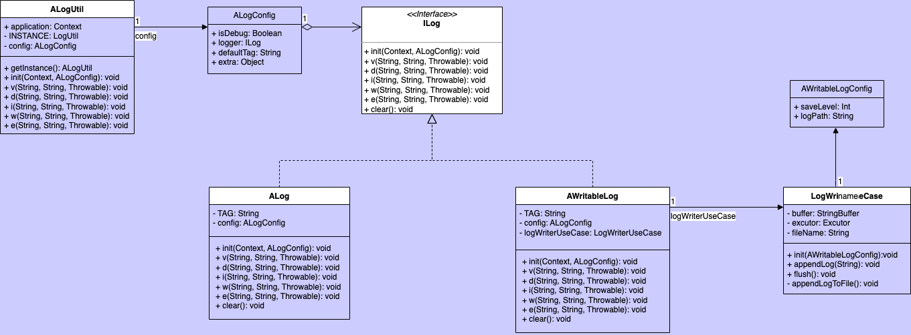

**ILog只提供日志输出的抽象规范，以统一整个工具库日志输出能力**

### 一、ALog类图关系如下



### 二、使用方式

1. 初始化`ALogUtil`，可参考如下代码(在Application中初始化)：

```kotlin
val config = ALogConfig(BuildConfig.DEBUG, ALog())
ALogUtil.init(this, config)
```

其中`ALogConfig`是初始化`ALogUtil`必要的配置类，目前4个可配置项：
`isDebug`：`Boolean`值，当前运行环境是否为debug；
`log`: `ILog`的实现类实例，具体用来打印日志的类，库中`ALog`为其默认实现，使用Android自带的`Log`进行日志打印；
`defaultTag`: `String`类型，默认日志tag，可以不配置，默认会使用**ALogUtil**作为tag；
`extra`: `Any`类型，额外的配置信息。子类在实现`ILog`接口后其需要的额外配置可以通过该字段设置，`ALogUtil`会将其传递给子类；

2. 调用`ALogUtil`日志方法，具体可参考工具类里的方法。
3. 库中有实现将日志写入到文件中的子类`AWritableLog`，采用简单文件写入方式，暂不兼容多进程能力，其初始化使用示例如下：

```kotlin
val awConfig = AWritableLogConfig(
    saveLevel = LOG_LEVEL_D,
    logPath = "${this.filesDir}${File.separator}ToolKit"
)
val config = ALogConfig(BuildConfig.DEBUG, AWritableLog(), extra = awConfig)
ALogUtil.init(this, config)
```

**注意：**库中实现的可写入日志文件的`AWritableLog`暂不支持多进程模式，建议可以使用更加成熟的日志系统，实现`ILog`接口注入进来；