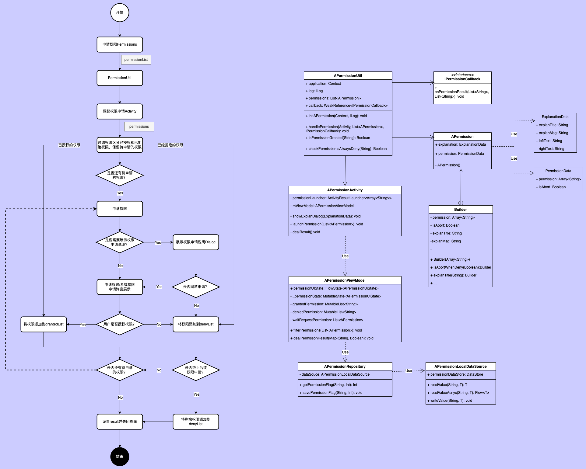

## 权限申请工具



### 使用步骤

1. 调用初始化方法 `initAPermission(context: Context, log: ILog? = null)` 初始化工具库
2. 构建权限申请数据，包含两部分：权限信息和解释说明信息；其中权限信息是必须的，解释说明信息是可选的。
   如果解释说明信息不为null则在正式申请权限前进行弹窗展示弹窗说明信息；构建并申请权限示例如下：

```kotlin 
// Builder构造函数里的权限组有多个时，这些权限应该是关联且适合在同时申请的。如果要申请多个不相关联的权限，请区分多个APermission构建权限数据。
val locationPermission = APermission.Builder(
    arrayOf(
       android.Manifest.permission.ACCESS_COARSE_LOCATION,
       android.Manifest.permission.ACCESS_FINE_LOCATION
    )
)
    .explainMsg(getString(R.string.request_location_msg))
    .build()
handlePermissions(this, listOf(locationPermission), callback)
```

3. 接收权限申请回调，提供两种方式：一是在申请时设置callback参数；二是在onActivityResult中接收回调结果。示例如下：

```kotlin
handlePermissions(this, permissions, object : IPermissionCallback {
    override fun onPermissionResult(granted: List<String>, denied: List<String>) {
        // do next action
    }
})

// or onActivityResult

override fun onActivityResult(requestCode: Int, resultCode: Int, data: Intent?) {
    super.onActivityResult(requestCode, resultCode, data)
    if (resultCode == APERMISSION_RESULT_CODE) {
        data?.let {
            val grantedList = it.getStringArrayExtra(APERMISSION_DATA_GRANTED)
            val deniedList = it.getStringArrayExtra(APERMISSION_DATA_DENIED)
            // do next action
        }
    }
}
```

4. 检查是否授予了对应权限，请使用`isPermissionGranted(permission: String)`进行检查。
5. 检查权限是否是"拒绝后不再提醒"，请使用`isPermissionAlwaysDenied(activity: Activity, permission: String)`进行检查。
6. 跳转系统权限设置页，请使用`goToPermissionSetting()`，华为、小米和OPPO会跳转到权限详情页，其他的默认跳转到应用信息详情页。

### 备注信息
api < 6.0
> 默认授予权限，不需要动态申请；

6.0 <= api < 11
> 需要动态申请
> 用户可以选择：拒绝（之后还可以再申请）、拒绝后不再提醒（不可再申请）、授予权限；

api >= 11
> 需要动态申请
> 用户可以选择：拒绝或授予权限
> 拒绝：拒绝2次以上即为"拒绝后不再提醒"

特殊权限处理
> 申请精确位置权限`android.Manifest.permission.ACCESS_FINE_LOCATION`
> 必须带上大致范围权限`android.Manifest.permission.ACCESS_COARSE_LOCATION`。
> 申请大致范围权限可以不带精确位置权限。
> Android 13以上新增通知栏权限：android.permission.POST_NOTIFICATIONS。
> 写入外部存储权限在Android 10以上不可再申请；

权限检查过滤情景梳理：
check：表示系统检查是否已经授权，取值true 或 false
requestFlag：表示请求权限的标识，-1（未申请过），0（申请过，用户同意了），1（申请过，用户拒绝了）

> case1：未申请过权限
> check=false, requestFlag=-1 --> 可申请权限，waitRequestList

> case2: 申请过，用户同意了
> check=true,requestFlag=0 --> 已授权，grantedList

> case3: 申请过，用户拒绝了
> check=false,requestFlag=1 --> 已拒绝，deniedList

> case4：申请过，用户同意了，但在设置里或三方软件中关闭了权限
> check=false,requestFlag=0 --> 可申请权限，waitRequestList

> case5: 申请过，用户拒绝了，但在设置里或三方软件中打开了权限
> check=true,requestFlag=1 --> 已授权，grantedList

> case6：未申请过，但用户在设置里打开了权限
> check=true,requestFlag=-1 --> 已授权，grantedList

**判断条件总结**：

```kotlin
if (check(permission)) {
    // 已授权
    grantedList.add(permission)
} else {
    if (requestFlag == 1) {
        // 已拒绝
        deniedList.add(permission)
    } else {
        // 待申请
        waitRequestList.add(permission)
    }
}
```

 
